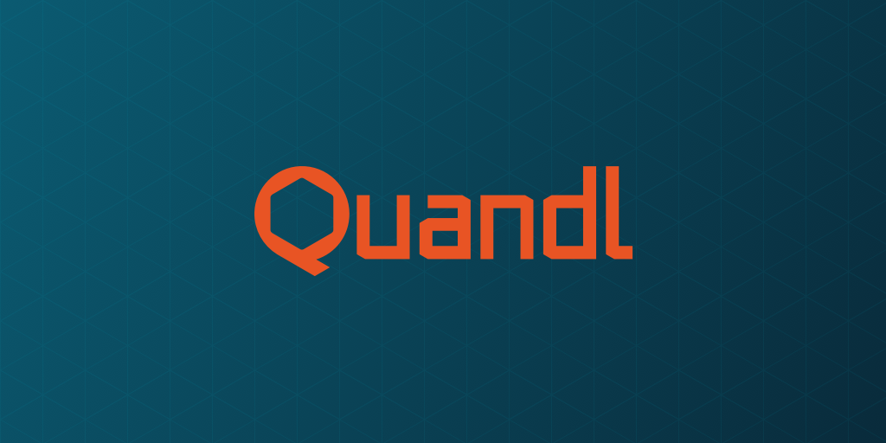
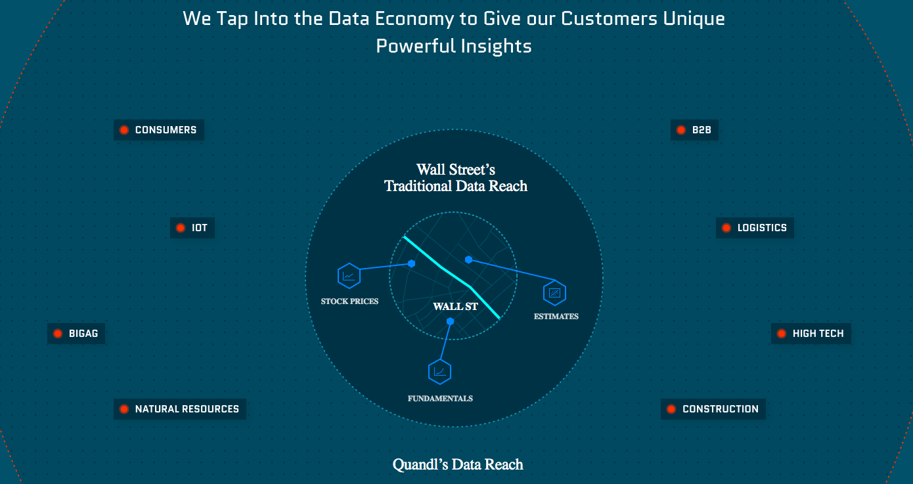
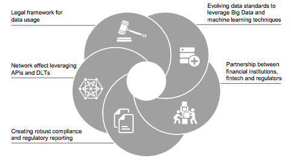

# FinTech-Case-Study

## *Financial Technology (Fintech) disrupting traditional Capital Investment Services* 

**Company of interest: Quandl** 

---

> *"Fintech brings about a new paradigm in which information technology is
driving innovation in the financial industry (Lee & Shin, 2017)"*

`Overview:` 

Traditional domains within the financial industry continue to be disrupted and forced to evolve in new ways due to the introduction and capabilites of new financial technology and fintech start-up companies entering the industry at high rates. One Canadian Fintech company in particular that has found success in disrupting traditonal financial products and services, and that this study will be focused on, is Quandl Inc. (also known as Nasdaq).  

Quandl Inc. offers a data search engine platform with the purpose of providing quick access to alternative and financial data (Pitchbook, 2023). The company was incorporated in 2011, in Toronto, Ontario, Canada. The founders of Quandl Inc. are Abraham Thomas & Tammer Kamel. 

The idea and innovation behind this company was driven by two main beliefs held by the founders about future direction of the finanical industry as a whole: 

1. Data is one of the most important resources of the 21st century (Quandl, 2023). 

2. The use of data and more specifically alternative data, will become the primary driver of active investment performance over the next decade (Quandl, 2023).

The funding for Quandl has been raised over 4 seperate rounds so far including: a Seed Round, Series A & Series B rounds, and the latest round of funding from a Venture Series (Crunchbase, 2023). Quandl has raised a total amount of CA$20.4M in funding so far (Crunchbase, 2023). Two of the most recent investors in the company are growX ventures and August Capital. 

---

`Business Activities:`

Fintech development, in most cases, serves the purpose of solving an exsisting financial problem and/or increasing efficiencies relating to methods used in traditional financial domains. Quandl believes the ability to make alpha (profit) generating investment decisions is rooted in resources like high quality and unique data; finding this data for yourself can be difficult and prolonged in most cases. Quandl aims to solve this financial problem by uncovering valuable data that is difficult to find, shaping it and sharing it with their clients. Technological developments in areas of infrastructure, big data and data analytics have allowed fintech startups to disintermediate traditional financial firms with unique, niche, and personalized services (Lee & Shin, 2017). At Quandl the belief is that there are new and better ways to understand complex information that creates markets and fuels market movements. The goal is to utilize their technology to find opportunities in places people normally would not think to look, and then insipre their customers to make new discoveries and incorprate them into their trading strategies (Quandl, 2023). 

Quandl delivers financial, economic and alternative data to over 400,000 people worldwide. Quandls customers include, but are not limited to, the worlds top: 

   - *Hedge Funds*
   - *Asset Managers*
   - *Investment Banks*

Quandl offers both free and paid for data packages. Alternative data packages for specific use come with a fee. 

**Competitive Advantage:**

> *"When analyzing data, actual analysis usually isn't your only task -- in fact, sometimes it's not even the most daunting. Acquiring, formatting and removing errors from data can pose significant challenges (not to mention take up lots of time)" (Machlis, 2013).* 

Quandl has disrupted the traditional means and channels of accessing and retrieving quality data for analysis - and that is what has made them successful in the market against their competitors. Quandl offers differentiated financial and economic data alongside a suite of unique, alpha-generating alternative datasets. They source, evaluate, and productize undiscovered data assets and then transform the data assets into quantified, actionable intelligence for specific institutional clients (Quandl, 2023). 

Unparalled consumption experience offered by Quandls products can help organizations attain increased efficiences, amongst increases in other areas of KPIs as well. No more wasted time searching for, cleaning or transforming data; users go from needing data to working with data in seconds. Top-tier publishers, wide range of datasets and various tools available for consumption through Quandls services has cemented their reputation in the industry for understanding and delivering what quantitative analysts need (Quandl, 2023).

**Technology behind Quandl:**

Quandl technology permits data access via an application program interface (API), which allows customers to customize the information in a format that is suitable for their needs (Smith, 2022). Quandl have been building and developing the technology and data science to support their data offerings since 2014. 

Quandl has intergrations with most major programming languages and analytical tools. Inclduing the following: 
   
   - API
   - R 
   - Python 
   - Excel 
   - Ruby 

Data is aquired through human curators pointing their bots at specific data sets, as opposed to searching the web as a whole, to then utilize pre-determined algorithms and big data tools to extract the desired unique and significant data (Machlis, 2013).  

Quandl leverages technology that enables it to source, screen and analyze unique data from non-traditional publishers which fuels trading models. The data is packaged and productized into feeds that do everyhting from ehancing fundamental stratgeies to powering the most sophisticated machine learning approches in use today (Quandl, 2023). 

Implementing alternative data sets:

 - *Alternative data packages derived from the use of Quandls technology enhance various trading strategies such as statistical arbitrage systematic equity. Investors leveraging broad coverage data sets offer them statistically robust trading signals on large sets of publicily tarded stocks.(Quandl, 2023)*

 - *Investors leveraging alternative data sets provide real time insights and trade patterns data to help traders improve foecasting models.(Quandl, 2023)*

 - *Alternative Data sets provide daily and weekly consumer transactions and good movement measurments, employment trends, and other relavent macro-economic indicators and information.(Quandl, 2023)*

---

`Financial Landscape:`

**Financial Domain - Capital Investment** 

Fintech in the capital investment domain is driven by the needs of market participants whos purpose is to gain deep insight into technologies and alternate business models (Bailey, 2016). A major factor involved in captial investment decisions for investors is data/information available for use. An investors ease of access to financial services, for example access to high quality and reliable data services, while analyzing capital investment options is imperative to making well-informed decisions and developing desired financial models. Fintech innovations in this domain have disrupted the traditional methods associated with financial institutions collection and interpretation of data/information. The combination of big data tools and analytics being utilized in the capital investment domain have had a significant impact in terms of solutions available to consumers regarding the preperation and interpretation of data (Bailey, 2016). Quandl is a company which has excelled in the capital investment domain within the financial industry from the products they have developed and offered to various types of investors through fintech. The evolution of fintech promises to reshape traditional capital investment domain by cutting costs, improving the quality of financial services availble, and creating a more diverse and stable financial landscape (Lee & Shin, 2017). The accuracy, speed, and cost reduction metrics associated with the utilization of Quandl data packages offers a clear competetive advantge to investors operating in a consistently evolving financial industry that is heavily influenced by new financial technology. 

> *"We are the preeminent aggregator of alternative data with a platform that enables innovation far beyond what can be accomplished with traditional market feeds."(Quandl, 2023)*

Many companies and financial institutions in the past have utilized "closed data" processes regarding the storage and accessibility of thier data. Traditional methods of retrieving and accessing data for investment decisions come with challenges and lengthily processes, that involve extracting, formatting and filtering raw data to make it meet your specific needs. Machine learning algorithms and artificial intelligence have been used to automate and increases efficiency’s relating to data retrieval processes. New financial technology has allowed data to be gathered, analyzed and utilized at speeds the traditional methods could never reach. 

**Major competitors in the domain:** 

1. Redis - California, United States: Redis is the sponsor of the open source database and delivers an enterprise-grade data platform to power real-time experiences (Crunchbase, 2023).

2. Preqin - London, United Kingdom: Preqin is a investment data company that provides financial data and insight on the alternative assets market, as well as tools to support investment in alternatives (Preqin, 2023). 

---

`Results of their business so far:`

Impact on the financial industry: 

> **8/10 of the largest hedge funds use Quandl** 

> **14/15 of the largest banks use Quandl**
                
> **10 million daily downloads**

Metrics used to determine success in the domain: 

One of the core metrics used to determine and measure success of companies in this domain is number of users on the platform. An increase in the number of users gives signals to the compoany that their product or service is having a positive impact in the market and gaining market share most likley. Using this metric to measure success means there must be a correlation between the number of users on a platform and the company performance. At Quandl the following company metrics have been essential in measuring and recognizing their success and performance so far: 

   - **In Q1 of 2017 Quandl reached the 200,000+ users benchmark (Quandl, 2023)**
   
   - **A year later in Q1 of 2018 the company had reached 300,000+ users on the platform benchmark (Quandl, 2023)**
   
   - **In Q3 of 2018 Quandl was involved in a strategic aquistion by Nasdaq (Quandl, 2023)**

---

`Recommendations:`

Fintech has the power to help traditional financial institutions/investors transition to new business models and access new areas of potiential growth.

> *"Much of the funding for capital markets AI solutions has been deployed at firms with proprietary IP focused on finding patterns and addressing complex problems that traditionally required vast human capacity to solve." (Bailey, 2016)*

Investment technology firms are offering financial instituions of all sizes the tools for monitoring markets and allowing for better decisions based data analysis (Bailey, 2016). I would recommmed that Quandl continues to bolster and amplify thier data packages by incorporating technology to perform robust data analysis that provides correlations between potiential areas of investment and risks associated with investments in those areas. 

Quandl's data packages are derived from a pool of publishers unparrled to most competitors. Quandl could leverage their access to the pool of publishers to incorporate complex risk assesment data in their packages that generate analysis that points out correlations between the risk associated with certain areas of investment expenditutures. Quandl is already a leader in the financial services industry with the unique data packages they offer and have been continualy reducing the unfavorable tasks associated with invesment analysis since they were established. Investing in the development of techonolgy to streamline another portion of the invesment analysis framework should continue to benfit the companys reputation surrounding the quality and unqiue factor of their products offered, while simultaneously helping them progress further in their mission as a company.  

The new technology ultilized to create packages that also offer risk assesment analysis, would include aspects of artificial intelleginece (AI) and machine learning (ML) applications to enable the enormous amounts of data to be analyzed in-depth and to yield the most meaningful information/insights from it. AI and ML techonolgies will have the power to quickly perform and solve complex risk assements of areas for potiential investment, reducing the potienial for human errors and misleading data/recommendations. 

---

# **Resources used:** 

https://data.nasdaq.com/

https://caia.org/sites/default/files/10_aiar_vol-5_issue-3_future-of-fintech.pdf

https://www.ivey.uwo.ca/scotiabank-digital-banking-lab/canada-fintech/capital-markets-trading/quandl/#:~:text=With%20a%20delivery%20system%20through,providing%20what%20professional%20analysts%20need.

https://demo.quandl.com/

https://www.cbinsights.com/company/quandl

https://pitchbook.com/profiles/company/62429-32#overview

https://www.computerworld.com/article/2474710/quandl--wikipedia-for-data-.html

https://alternativedata.org/data_provider/quandl/

https://www.crunchbase.com/organization/quandl

https://www.investopedia.com/articles/markets/081116/5-fintech-firms-emerging-canada-mftgf-vggof.asp

https://d1wqtxts1xzle7.cloudfront.net/60183957/BH865-PDF-ENG__Fintech__Ecosystem__business_models_20190801-95998-19ksrtq-libre.pdf?1564728494=&response-content-disposition=inline%3B+filename%3DScienceDirect_Fintech_Ecosystem_business.pdf

https://www.investopedia.com/terms/f/fintech.asp

https://stackshare.io/quandl/quandl

